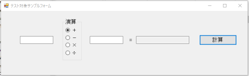
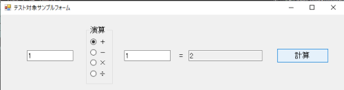
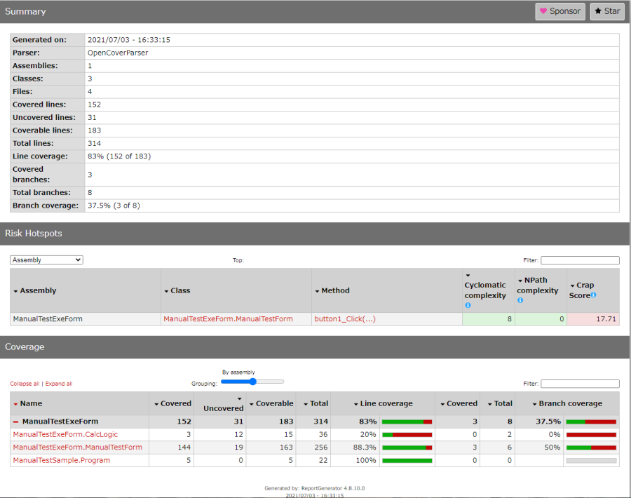
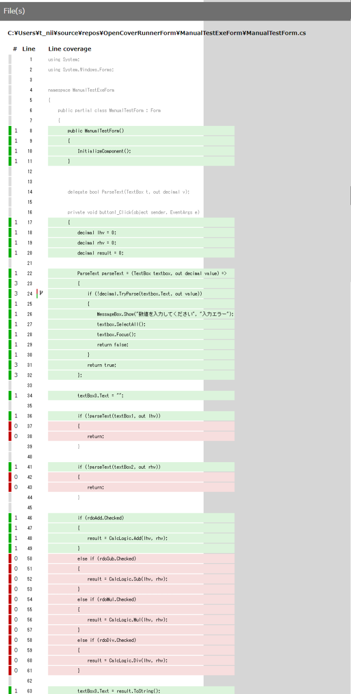
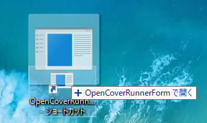

# レガシーシステムでも実施できる、単体テスト(手動テスト)のカバレッジ測定(.NET)

[ソフトウェア品質を高める開発者テスト](https://www.amazon.co.jp/dp/4798165034)を読みました。
自分がやっているテスト手法は20年前から変わっていませんが、グローバルスタンダードからは周回遅れになっているのだと気づかされました。

とはいえ、いきなり「`ユニットテスト`」しろ、「`コードカバレッジ計測(C1網羅)`」しろといわれても、10年前のソースに手を入れる勇気も時間もありません。
また、最近は新規開発が少なく、新しいことを始めるのもできない現状です。
それに、受託開発が主流の日本では、継続的な開発を前提にした海外の手法と相容れない部分もあるのかなと感じています。

とはいえ多少なりとも効果を出せて、かつ継続できる方法はないかと色々考えてみました。
手動テストでカバレッジを測定し、後からユニットテストを少しずつ増やしながらカバレッジを統合できれば、漸進的にできるのではないかと。

--- 

## ■単体テスト改善案（カバレッジ測定併用）■

### ①いつも通りに単体テスト(手動テスト)をしながら、カバレッジが測定できると嬉しい。
  ⇒カバレッジ率と、分岐を確認しながらテストできる。
### ②手動テストでカバレッジ不足が見つかったら、テストケースを追加して再テストしたい。
  ⇒カバレッジがマージできると嬉しい。
### ③ユニットテストを書いたら、手動テストのカバレッジ結果とマージ出来ると更に良い。
  ⇒新機能の追加を行う部分から、ユニットテストを始められる。

---

絵に描いた餅を食べるため、久しぶりに腕をまくってツールを作りました。CI／CDのような難しいセットアップは不要、誰でも簡単に始められます。

## 【[OpenCoverRunner](https://github.com/murasuke/OpenCoverRunner)】です

* .NET Framework用のカバレッジ測定ツールです(「[OpenCover](https://github.com/OpenCover/opencover) 」「[ReportGenerator](https://github.com/danielpalme/ReportGenerator)」を利用）

* `.exe`と`asp.net`のカバレッジを取得できます。

* テスト対象のプログラムをフォームにDrag＆Dropして「実行」します。テスト実施後、プログラムを終了すると「カバレッジ」のレポートが表示される仕組みです。

* コマンドライン実行もサポートしています。OpenCoverRunnerFormのプログラムに、テスト対象をDrag＆Dropすれば、コマンドライン引数にプログラムパスが渡されるので実行できます。

* カバレッジ測定ツール「[OpenCover](https://github.com/OpenCover/opencover) 」「[ReportGenerator](https://github.com/danielpalme/ReportGenerator)」のパスは起動時に検索するので、設定不要です。

## 特徴

* UnitTestがないレガシーコードのみで構成されたプロジェクトでも、手動テストをすれば分岐漏れが確認できます(C1カバレッジができていることをエビデンスとして残せる)。

* UnitTestも実行できます。手動テストの結果とマージされるため、新規開発分だけUnitTestを行い、古いソースの回帰テストは手動で行うことができます。

* プログラムを手動テストする毎に徐々にカバレッジをが上がり、テスト漏れがないかチェックすることができます。（数日にわたる手動テストでも、自動的にマージされます）

* 無駄なテストを省くことができます。C1カバレッジが確認できれば、それ以上テストする必要はないはずです（開発者テストの段階で）

* デバッグしながら、同時にカバレッジ率測定できます。(プロセスにアタッチしてデバッグ)

## 実行手順

* OpenCoverとReportGeneratorはNuGetでインストール済みの前提(インストール方法は後で説明)

* テスト対象プログラム・・・四則演算を行う単純なプログラムです

### GUIを表示して実行する場合

* 1. プログラムを起動する。

  

* 2. テスト対象プログラムパスを入力（exeをドラッグ＆ドロップ)で入力できます。

* 3. 「テスト対象プログラム起動」ボタンをクリック。起動したプログラムを手動で操作(テスト)します。（確認のため、加算「＋」のみ実行）

  

* 4. プログラムを終了すると、レポートが表示されます。テスト時に「＋」のみ確認したため、加算のみ実行していることがわかります。

  
　

  
### コマンドラインから実行する場合

* 1. デスクトップに'OpenCoverRunnerForm.exe'のショートカットを作成し、そこへテスト対象プログラムをドラッグ＆ドロップします。

  

  
* 2. 「テスト対象プログラム起動」ボタンをクリック。起動したプログラムを手動で操作(テスト)します。（確認のため、加算「＋」のみ実行）

  

* 3. 以降はGUIから実行した場合と同じです。

## 利用ツールインストール方法

NuGetでインストールします。

* [OpenCover](https://github.com/OpenCover/opencover) カバレッジ測定ツール(カバレッジ収集結果を.xmlファイルに保存)

* [ReportGenerator](https://github.com/danielpalme/ReportGenerator) レポート生成ツール(xmlからhtmlなど読みやすい形に成形)

  ※インストールが面倒な場合[github.com/murasuke/OpenCoverRunner](https://github.com/murasuke/OpenCoverRunner)をCloneして、VS2017以降でビルドしてください（ビルド時に自動でインストールされます)

## ソリューション構成

| ソリューション名 |説明 |
|-----------|------------|
| OpenCoverRunner | OpenCoverRunner本体。引数をつけなければFormを表示。引数にプログラムパスもしくは、WebAppフォルダを渡せば、フォームを起動せずに実行。|
| ManualTestExeForm | 動作確認用サンプルプログラム(Windows フォーム)(手動テスト対象) |
| ManualTestWebForm | 動作確認用サンプルプログラム(ASP.NET Webフォーム) |
| UnitTestProject | ManualTestExeFormのユニットテスト。Logicのみテストを行う(Formは対象外) |

## 補足説明・・・コマンドライン引数について

| 引数 | 値 |説明 |
|-----------|------------|------------|
| 引数なし | |フォームを起動し画面から操作する |
| 最初の引数| <対象プログラム> | 引数で与えられたプログラムを起動する。拡張子がexeの場合、プログラムを起動。フォルダの場合、IISExpressを起動。終了後レポートを生成|
| 2つ目以降| -hideresult | 実行後、レポートをブラウザで開かない（未指定の場合、ブラウザでレポートを開きます） |
|  2つ目以降| -mergeresult |指定した場合、前回のカバレッジとマージします。未指定の場合、今回操作した分のカバレッジのみになります。|

* 例

  > OpenCoverRunnerForm.exe d:\target.exe

  > OpenCoverRunnerForm.exe d:\tagetWebApp -hideresult  -mergeresul

### OpenCoverの主要な引数（参考情報）
  
| 引数 | 説明 | 例 |
|-----------|------------|:------------|
|-target:<ターゲットパス>  | カバレッジ計測対象のexeパス |-target:"C:\TestTarget\bin\Debug\TestTarget.exe" |
|-output:<出力ファイル(xml)>|計測結果を保存するパス(xml)|-output:"C:\TestTarget\bin\Debug\results.xml" |
|-register[:user]|プロファイラへの登録で利用するユーザを指定。管理者権限がない場合、userを指定すれば良いようです|-register:user|

### ReportGeneratorの主要な引数（参考情報）

| 引数 | 説明 | 例 |
|-----------|------------|------------|
|-reports:<OpenCover出力ファイル(xml)>  | OpenCoverで出力した測定結果ファイル(xml) |-reports:"C:\TestTarget\bin\Debug\results.xml" |
|-reporttypes:<出力タイプ>|Html,HtmlInline,MarkdownSummaryなど選択できます|-reporttypes:HtmlInline; |
|-targetdir:<出力先>|レポートファイル出力先|-targetdir:C:\TestTarget\bin\Debug\|

## その他

* pdbファイルがexeと同じ場所に無くても、カバレッジ測定ができるように対応

  * IMAGE_DIRECTORY_ENTRY_DEBUGからexeに埋め込まれたpdbファイルのパスを取得するように対応

* -historydir:history を指定すると、過去との比較ができる？要確認
